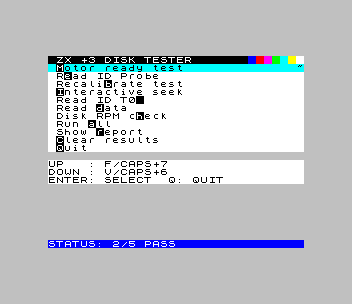

# zx3-disk-tester

⚠️Not fully tested on a real +3 - no guarantee it won't break your floppies. You have been warned!⚠️

[](https://github.com/corbym/zx3-disc-check/actions/workflows/smoke-test.yml)

A low-level ZX Spectrum +3 floppy drive test utility written in C and built with **z88dk**. Communicates directly with the internal +3 floppy controller (uPD765A compatible) via dedicated I/O ports.

## Features

- **Motor + drive status** – Combined motor control and ST3 status check
- **Drive probe (Read ID)** – Probe media and report controller status bytes; decodes ST1/ST2 on failure
- **Recal + seek track 2** – Track-0 recalibrate then seek verification
- **Interactive step seek** – Manually step the head track by track
- **Read ID** – Read sector ID from track 0 (requires readable disk)
- **Read track data loop** – Continuously reads sector data on selected track (`J`/`K` to change track)
- **Disk RPM checker** – Rotational-speed estimate from repeated ID reads; requires readable sector IDs
- **Run all** – Execute all core tests in sequence and display a report card
- **Show report card** – Display last run results (PASS / FAIL / NOT RUN per test)
- **Clear stored results** – Reset all stored test results
- **Direct-key menu UI** – Navigation and hotkeys respond directly; confirmation prompts use `ENTER`

## Hardware & I/O Ports

Targets the **ZX Spectrum +3** internal floppy system:

| Port | Name | Direction | Purpose |
|------|------|-----------|---------|
| `0x1FFD` | System Control | Write | Motor control (bit 3), memory/ROM paging control |
| `0x2FFD` | FDC MSR | Read | Floppy controller main status register |
| `0x3FFD` | FDC Data | Read/Write | Floppy controller data register |

## Build

### Prerequisites

- `z88dk` in your PATH (provides `zcc`, `z88dk-dis`)

### Quick build

```sh
./build.sh
```

Produces:
- `out/disk_tester.tap` – Loadable via DivMMC on real +3 or in ZEsarUX emulator
- `out/disk_tester_plus3.dsk` – Bootable +3 disk image

> **DivMMC note**: at startup the program copies the character font from ROM to a RAM buffer before any ROM paging changes, so character rendering is correct regardless of what DivMMC leaves active.

### Build flags

| Flag | Effect |
|------|--------|
| `DEBUG=1` | Enable debug output (paging state, seek loops, MSR/ST0 values) |
| `COMPACT_UI=1` | Denser font. Keep off for CI/OCR smoke tests. |

## Running

### On real hardware (via DivMMC)

1. Build → `out/disk_tester.tap`
2. Copy to SD card, boot +3 with DivMMC, load the TAP file

### Smoke tests (ZEsarUX emulator)

```sh
./run_tests.sh
```

Requires `zesarux` on your PATH (or set `ZESARUX_BIN`) and a working Go toolchain. Set `ZX3_REQUIRE_EMU_SMOKE=1` to fail if the emulator is unavailable (used in CI).

Smoke tests require prebuilt artifacts (`out/disk_tester.tap`, `out/disk_tester_plus3.dsk`). Run `./build.sh` or use CI artifacts first.

The suite starts ZEsarUX in headless +3 mode, loads the TAP file, exercises key menu paths via ZRCP, and compares staged UI screenshots against approved baselines in `tests/approved/screen-check/`.

### Latest CI Screen Pages




## Docker Build & CI

```sh
# Build image
docker build -t zx3-disk-test:latest .

# Run smoke tests
docker run --rm -e ZX3_REQUIRE_EMU_SMOKE=1 zx3-disk-test:latest \
  bash -c "cd /workspace && ./run_tests.sh"
```

### GitHub Actions

Three workflows:
1. `toolchain-image.yml` – builds and publishes a prebuilt toolchain image to GHCR when the Dockerfile changes
2. `smoke-test.yml` – pulls that image for CI runs (falls back to local build if missing); runs on pushes/PRs to `main`, `master`, `develop`
3. `manual-release.yml` – release packaging/tag flow

The smoke workflow runs with `ZX3_REQUIRE_EMU_SMOKE=1` and uploads staged UI screenshots as CI artifacts.

## Files

- `disk_tester.c` – Main program logic (tests, menu, I/O handling)
- `disk_tester.h` – Helper declarations
- `menu_system.c` – Input/model layer (key scanning, menu items, navigation)
- `menu_system.h` – Menu system interface
- `intstate.asm` – Low-level port I/O and motor control (Z80 assembly)
- `build.sh` – Build script
- `deploy.sh` – Build + validate artifacts
- `run_tests.sh` – Run the Go smoke test suite
- `tests/emulator_harness.go` – ZEsarUX process and ZRCP socket primitives
- `tests/emulator_client.go` – Emulator lifecycle and high-level ZRCP operations
- `tests/smoke_emulator_test.go` – Emulator-driven smoke test suite

## License

This repository is released under the **Unlicense**.
