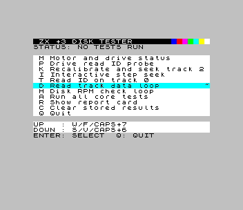

# zx3-drive-tester

⚠️ Not fully tested on all +3 hardware variants — no guarantee it won't break your floppies. You have been warned! ⚠️

[](https://github.com/corbym/zx3-disc-check/actions/workflows/smoke-test.yml)

A low-level ZX Spectrum +3 floppy drive diagnostic utility written in C and built with **z88dk**. Communicates directly with the internal +3 floppy controller (uPD765A compatible) via dedicated I/O ports. No BASIC, no OS — raw FDC commands only.

## Menu

| Key | Test | Description |
|-----|------|-------------|
| `M` | Motor/Drive Status | Spin up motor, read ST3, report ready/write-protect/track-0 bits |
| `E` | Read ID Probe | Issue READ_ID and report full ST0/ST1/ST2 register decode; works even with no disk |
| `B` | Recalibrate Test | Recalibrate to track 0 then seek to track 2; validates each step independently |
| `I` | Step Seek | Interactive head step — move track by track, read current position |
| `T` | Read ID Track 0 | Read sector IDs from track 0; requires a readable disk |
| `D` | Read Data | Continuous sector read loop; `J`/`K` change track, `F`/`V` scroll hex+ASCII panel |
| `H` | Disk RPM | Rotational speed estimate from repeated READ_ID timing; displays live RPM and pass/fail counts |
| `A` | Run All | Execute all core tests in sequence and display a summary report card |
| `R` | Show Report | Display last run results (PASS / FAIL / NOT RUN per test) |
| `C` | Clear Results | Reset all stored test results |
| `Q` | Quit | Exit to BASIC |

### Navigation

| Key(s) | Action |
|--------|--------|
| `F` / `CAPS+7` / `W` | Move selection up |
| `V` / `CAPS+6` / `S` | Move selection down |
| `ENTER` | Run selected test |
| Direct hotkey (`M`, `E`, `B` …) | Jump directly to that test |

## Diagnostics

### Recalibrate and Seek Test (`B`)

This test runs in three stages. Each is reported independently on the test card:

1. **Drive ready** — reads ST3 and checks the `RY` bit. Failure here means the drive does not see a disk or the motor did not spin up in time. Check: disk inserted, door closed, motor cable.
2. **Recalibrate** — issues a RECAL command and waits for the FDC interrupt. The head should step inward until the track-0 sensor fires. Failure here means the RECAL command was rejected or the seek-complete interrupt never arrived. ST0 and the returned PCN are shown on failure.
3. **Seek to track 2** — seeks outward two tracks. Failure means the seek command was rejected or PCN did not reach 2. ST0 and PCN are shown.

If the test shows **FAIL on real hardware** but the drive appears mechanical sound:
- Run **Motor/Drive Status** first to confirm ST3 reports `RY=1` (ready) and `T0=1` (head at track 0 after a prior recal).
- A failing RECAL with PCN stuck at a non-zero value usually points to a stiff/dirty head mechanism or a worn track-0 sensor.
- A passing RECAL but failing SEEK usually points to a stepper fault (missing steps) or a bad step-pulse connection.
- ST0 `SE=0` after RECAL means the FDC never received a seek-complete interrupt — check the FDC interrupt line.

### Disk RPM Check (`H`)

Measures rotational period by timing READ_ID calls until the same sector ID reappears after one full revolution. Displays live RPM and running pass/fail counts.

**Standard ZX Spectrum +3 disk speed: 300 RPM** (nominally 200 ms per revolution).

If RPM reads are **erratic or fluctuating**:
- A single-sample measurement is inherently noisy — the timing loop captures one revolution at a time and can be thrown off by FDC interrupt latency or OS jitter. The displayed value is each individual sample, not an average.
- Variation of ±5–10 RPM between samples is normal on real hardware. Sustained variation of ±20+ RPM suggests the drive motor or its speed-control circuit needs attention.
- Check that the drive belt (if belt-driven) is intact, not stretched, and seated correctly.
- A worn or contaminated speed-control pot on the drive PCB is the most common cause of unstable RPM on aged hardware.
- Run the test for 20–30 seconds and note whether the readings cluster around 300 RPM or drift continuously. Drifting continuously is a speed-control fault; occasional outliers are measurement noise.

### Status Register Decode

The Read ID Probe (`E`) and other failure paths show raw ST0/ST1/ST2 values. Key bits:

| Register | Bit | Name | Meaning when set |
|----------|-----|------|-----------------|
| ST0 | 7:6 | IC | `00`=normal end, `01`=abnormal end, `10`=invalid cmd, `11`=drive not ready |
| ST0 | 5 | SE | Seek end — head reached target track |
| ST0 | 4 | EC | Equipment check — track-0 signal not found during RECAL |
| ST0 | 3 | NR | Not ready |
| ST1 | 7 | EN | End of cylinder — read/write past last sector |
| ST1 | 5 | DE | Data error — CRC fault in ID or data field |
| ST1 | 4 | OR | Overrun — host too slow to service DRQ |
| ST1 | 2 | ND | No data — sector ID not found |
| ST1 | 0 | MA | Missing address mark |
| ST2 | 6 | CM | Control mark |
| ST2 | 5 | DD | Data CRC error in data field |
| ST2 | 4 | WC | Wrong cylinder — head not at expected track |
| ST2 | 1 | BC | Bad cylinder |
| ST2 | 0 | MD | Missing data address mark |

> **uPD765A read completion note**: on Spectrum +3 hardware, software cannot drive the FDC Terminal Count (TC) line. A successful `READ DATA` may finish with `ST0.IC=01` and `ST1.EN=1` (instead of clean zero status). The tester treats this specific pattern as success when no other error bits are present.

## Hardware and I/O Ports

Targets the **ZX Spectrum +3** internal floppy system:

| Port | Name | Direction | Purpose |
|------|------|-----------|---------|
| `0x1FFD` | System Control | Write | Motor control (bit 3), memory/ROM paging |
| `0x2FFD` | FDC MSR | Read | Floppy controller main status register |
| `0x3FFD` | FDC Data | Read/Write | Floppy controller data register |

Reference documentation:
- [Spectrum +3 disc controller (NEC uPD765) — problemkaputt.de](https://problemkaputt.de/zxdocs.htm#spectrumdiscspectrum3disccontrollernecupd765)
- [uPD765A Disc Controller Primer — muckypaws.com](https://muckypaws.com/2024/02/25/%C2%B5pd765a-disc-controller-primer/)

## Build

### Prerequisites

- `z88dk` in your PATH (provides `zcc`, `z88dk-dis`)

### Quick build

```sh
./build.sh
```

Produces:
- `out/disk_tester.tap` — loadable via DivMMC on real +3 or in ZEsarUX emulator
- `out/disk_tester_plus3.dsk` — bootable +3 disk image

> **DivMMC note**: at startup the program copies the character font from ROM to a RAM buffer before any ROM paging changes, so character rendering is correct regardless of what DivMMC leaves active.

### Build flags

| Flag | Effect |
|------|--------|
| `DEBUG=1` | Enable debug output (paging state, seek loops, MSR/ST0 values) |
| `HEADLESS_ROM_FONT=1` | Use ROM font copy instead of embedded font (used by CI for OCR) |
| `OUT_DIR=path` | Write all build outputs to `path` instead of `out/` |

### CI / deploy build

```sh
./deploy.sh
```

Builds two variants:
- `out/` — headed build with embedded custom font (for screenshots and real hardware)
- `out/headless/` — headless build with ROM font copy (for OCR smoke tests)

## Running

### On real hardware (via DivMMC)

1. Build → `out/disk_tester.tap`
2. Copy to SD card, boot +3 with DivMMC, load the TAP file

### Smoke tests (ZEsarUX emulator)

```sh
./run_tests.sh
```

Requires `zesarux` on your PATH (or set `ZESARUX_BIN`) and a working Go toolchain. Set `ZX3_REQUIRE_EMU_SMOKE=1` to fail if the emulator is unavailable (used in CI).

Smoke tests require prebuilt artifacts. Run `./deploy.sh` first, or use CI artifacts.

The suite starts ZEsarUX in headless +3 mode and runs two separate passes:
- **OCR smoke tests** — load the headless TAP; exercise all menu paths via ZRCP and verify screen text with Tesseract
- **Screenshot capture** — load the headed TAP; capture staged UI screenshots and compare against approved baselines in `tests/approved/screen-check/`

Override the TAP or DSK path with `ZX3_TAP_PATH` and `ZX3_DSK_PATH` environment variables.

### Latest CI Screenshots

<table>
  <tr>
    <td align="center">
      
      <br />
      <sub>01. Main menu</sub>
    </td>
    <td align="center">
      
      <br />
      <sub>02. Motor + drive status</sub>
    </td>
  </tr>
  <tr>
    <td align="center">
      
      <br />
      <sub>03. Menu after motor test</sub>
    </td>
    <td align="center">
      
      <br />
      <sub>04. Report card</sub>
    </td>
  </tr>
  <tr>
    <td align="center">
      
      <br />
      <sub>05. Menu after report card</sub>
    </td>
    <td align="center">
      
      <br />
      <sub>06. Run-all complete</sub>
    </td>
  </tr>
  <tr>
    <td align="center" colspan="2">
      
      <br />
      <sub>07. Read-data loop hex preview</sub>
    </td>
  </tr>
</table>

## Docker Build and CI

```sh
# Build image
docker build -t zx3-disk-test:latest .

# Run smoke tests inside container
docker run --rm -e ZX3_REQUIRE_EMU_SMOKE=1 \
  -v $(pwd):/workspace zx3-disk-test:latest \
  bash -c "cd /workspace && ./run_tests.sh"
```

### GitHub Actions

Three workflows:
1. `toolchain-image.yml` — builds and publishes a prebuilt toolchain image to GHCR when the Dockerfile changes
2. `smoke-test.yml` — pulls that image (falls back to local build if missing); runs on push/PR to `main`, `master`, `develop`; runs OCR tests against headless build and screenshot tests against headed build; uploads both artifact variants
3. `manual-release.yml` — release packaging and tag flow

## Files

| File | Purpose |
|------|---------|
| `disk_tester.c` | Main program: test orchestration, menu loop, report card |
| `disk_tester.h` | Shared declarations |
| `disk_operations.c` | Low-level FDC command layer: motor, seek, READ_ID, READ_DATA |
| `disk_operations.h` | FDC API and result structs (`FdcStatus`, `FdcChrn`, `FdcSeekResult`) |
| `menu_system.c` | Key scanning, menu items, navigation model, menu rendering |
| `menu_system.h` | Menu system interface |
| `ui.c` | Screen rendering, attribute layout, font initialisation |
| `ui.h` | UI interface |
| `test_cards.c` | Test card layout and state rendering |
| `test_cards.h` | Test card API |
| `shared_strings.c` | Shared string constants (deduplication across translation units) |
| `shared_strings.h` | Extern declarations for shared strings |
| `intstate.asm` | Z80 assembly: port I/O primitives, motor control |
| `build.sh` | Build script |
| `deploy.sh` | Dual build (headed + headless) for CI |
| `run_tests.sh` | Run the Go smoke test suite |
| `tests/emulator_harness.go` | ZEsarUX process management and ZRCP socket primitives |
| `tests/emulator_client.go` | High-level emulator operations (OCR, screenshot, key send) |
| `tests/smoke_emulator_test.go` | Emulator-driven smoke and screenshot regression tests |

## License

This repository is released under the **Unlicense**.
